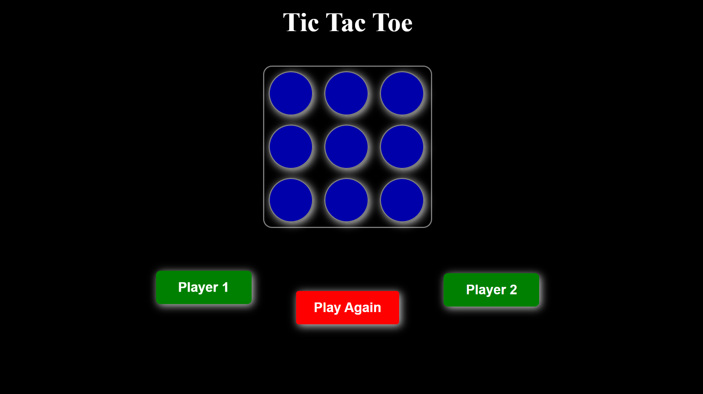

# 🎮 Tic Tac Toe Game

A responsive, dark-themed **Tic Tac Toe (X-O)** game built with **HTML**, **CSS**, and **JavaScript**. Playable on all devices — mobile, tablet, and desktop — with smooth animations and clean UI.

 <!-- You can add an actual screenshot image here -->

---

## 🌟 Features

- ✅ Classic 3x3 Tic Tac Toe game
- 🌙 Elegant **Dark Theme**
- 📱 Fully **Responsive Design**
- 🧠 Smart turn-based logic (Player X and Player O)
- 🔁 Reset/Restart Game Button
- ✨ Simple, clean, and interactive UI

---

## 📂 Technologies Used

- **HTML5** – Markup structure  
- **CSS3** – Styling and dark theme  
- **JavaScript (ES6)** – Game logic and DOM interactions  
- **Flexbox/Grid** – For responsive layout

---

## 🖼️ Live Demo

[🔗 Play Now](https://your-live-demo-link.com)  
*(Replace with your actual GitHub Pages or Netlify link)*

---

## 🚀 How to Run Locally

1. **Clone this repo**

```bash
git clone https://github.com/yourusername/tic-tac-toe-game.git
cd tic-tac-toe-game
Open index.html in any browser

bash
Copy
Edit
# You can simply double-click index.html
✅ That’s it! Start playing.

📸 Screenshots
💻 Desktop View

📱 Mobile View

⚙️ Game Logic Overview
Alternates between Player X and Player O

Checks for a win or draw after every move

Disables board after game over

Offers replay with one click

🔧 Folder Structure
bash
Copy
Edit
tic-tac-toe-game/
│
├── index.html       # HTML structure
├── style.css        # CSS styles (dark theme, responsive)
├── script.js        # JavaScript game logic
└── README.md        # Project documentation
🙌 Future Improvements
Add score tracking

Add sound effects

Add multiplayer or AI mode (vs computer)

🤝 Contributing
Feel free to fork the repo and send pull requests for improvements or new features.

📝 License
This project is licensed under the MIT License.

🙋‍♂️ Author
Built with 💻 by Your Name
Follow me for more front-end projects!